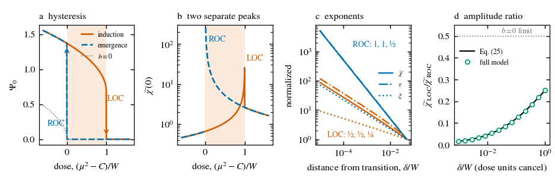

# The Mind–Thought Entanglement Theory (MTE)

**Code for a classical two-field model of conscious unity, with asymmetric critical signatures at loss and recovery of consciousness**

This repository contains the code that reproduces the numerical results and generated figures of:

> Ning H, Ayana J W, Ding J. *The Mind–Thought Entanglement Theory (MTE): A Two-Field Model of Conscious Unity with Asymmetric Critical Signatures at Loss and Recovery of Consciousness.* Submitted to *Neuroscience of Consciousness*, 2026.

> **Note on the name.** MTE is the historical name of the framework. In this work "entanglement" means the mutual constraint between a global experiential state and the context of its contents. The model is entirely classical, and no quantum property is claimed.

---

## The model in brief

A global order parameter Ψ on the cortical sheet is coupled locally and symmetrically to one hidden, damped, propagating context mode φ₀:

```
(∂t² + γ1 ∂t − c1² ∇² + μ²) Ψ + λ Ψ³ = (g1 + g2 Ψ) φ0
(∂t² + γ2 ∂t − c2² ∇² + m²) φ0      = g1 Ψ + (g2/2) Ψ²
```

The model makes two kinds of claim.

- **Linear sector (necessary condition only).** Perturbations propagate on two damped branches (P1). A sustained focal drive produces a two-component spatial response with positive weights (P4). A generalized identity (G1–G3) links the two with no free parameter. The code shows that a conventional cortical model shares this signature: one excitatory field carried by short and long axonal fibres. Passing these tests is therefore necessary but not sufficient.
- **Phase boundary (the consciousness-specific prediction, P5).** The cross-coupling term makes the transition between the unified and non-unified phases discontinuous. Loss of consciousness (LOC) is then a saddle-node, and recovery of consciousness (ROC) is a transcritical bifurcation. The exponents therefore differ:

  | Transition | susceptibility χ | relaxation time τ | correlation length ξ |
  |---|---|---|---|
  | LOC | ½ | ½ | ¼ |
  | ROC | 1 | 1 | ½ |

  Each peak is approached from one side only. The ratio of the two peaks, χ_LOC/χ_ROC = 1/[2(1+√(W/δ))], depends only on the measured hysteresis width W and the dose distance δ.



*Fig. 3 of the paper, generated by `code/make_figs.py`.*

---

## Quick start

Tested with Python 3.12, NumPy 2.4, SciPy 1.17 and Matplotlib 3.10.

```bash
git clone https://github.com/WakumaAyanaJifar/The-Mind-Thought-Entanglement-Theory.git
cd The-Mind-Thought-Entanglement-Theory
pip install -r requirements.txt
python run_all.py            # all results, about 1 minute on a laptop
python run_all.py --quick    # skips the parameter-recovery study
```

Results are written to `outputs/`, and each script's printed output goes to `outputs/logs/`. The reference output is in `expected_output/`, and all random seeds are fixed, so the numbers should match. The only expected differences are round-off in the two zero eigenvalues of `static2d` (about 10⁻¹²) and small changes with other library versions.

---

## What each script reproduces

| Script (`code/`) | Paper | Expected result |
|---|---|---|
| `check1.py` | §3.3, Fig. 2b | k=0 resonances ±2.398−0.393i, ±0.797−0.357i; κ₋=0.962, κ₊=3.150, R₋=0.804; both sides of G1 = 3.030 |
| `twofibre.py` | §3.3, Suppl. S2 | Two-fibre competitor: G1 and G3 hold in 1,125/1,125 models; mixed-sign coupling gives a negative weight in 1,445/1,445 |
| `boundary.py` | §3.4, Fig. 3, Suppl. S4 | Slopes at LOC −0.504, −0.506, −0.252; at ROC −1.000, −1.000, −0.500; peak ratio matches the closed form; post-jump ratio 4; bias crossover at √(12bJ) |
| `potential_splitting.py` | §3.6, Fig. S4 | ΔV = 0.2205 (first-order value 0.2250) |
| `fisher.py` | §3.8, Table S2 | Jacobian rank 8/8, condition numbers 36.1, 37.0, 31.2; Cramér–Rao bounds |
| `static2d.py` | §3.5, Suppl. S3, Fig. S3 | Static threshold state in d=2: peak 0.954, FWHM 5.18, one unstable eigenvalue −1.230 |
| `static2d_conv.py` | Table S1 | Same state on a finer, larger grid (convergence check) |
| `recovery7.py` | §3.8, Table S3 | Recovery of all 7 dispersion parameters plus amplitude: 360/360 fits converge; median errors ≲1% |
| `make_figs.py` | Figs. 1, 3, S3 | `fig1_rev`, `fig3_boundary`, `figS3_static2d` (PDF and PNG) |

---

## Repository structure

```
.
├── README.md
├── CITATION.cff
├── requirements.txt
├── run_all.py            # runs every script in order and logs the output
├── code/                 # analysis scripts (see table above)
├── expected_output/      # reference logs for comparison
└── figures/              # figures generated by code/make_figs.py
```

---


## Contact

Jifar Wakuma Ayana, University of Science and Technology Beijing.
Corresponding authors: Huansheng Ning (ninghuansheng@ustb.edu.cn) and Jianguo Ding (jianguo.ding@bth.se).
